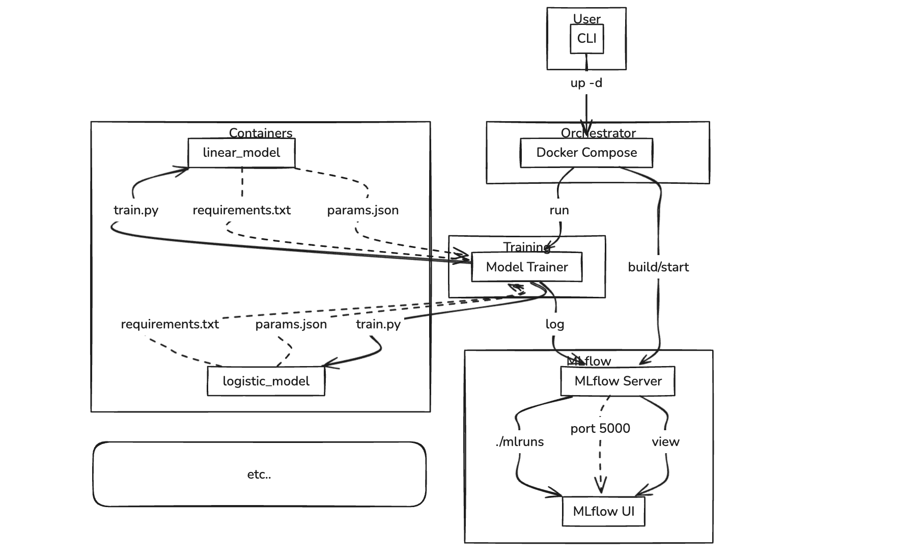

# ML Model Management with MLflow and Docker

This project demonstrates a setup for managing machine learning models using MLflow for experiment tracking and Docker/Docker Compose for environment containerization.

## Table of Contents

- [Features](#features)
- [Prerequisites](#prerequisites)
- [Setup and Installation](#setup-and-installation)
- [Project Structure](#project-structure)
- [Usage](#usage)
  - [Training Models](#training-models)
  - [Accessing MLflow UI](#accessing-mlflow-ui)
- [Contributing](#contributing)
- [License](#license)

## Features

- **Containerized Environment**: Uses Docker and Docker Compose to provide isolated and reproducible environments for model training.
- **MLflow Integration**: Tracks machine learning experiments, parameters, metrics, and artifacts using MLflow.
- **Multiple Models**: Includes examples for training both linear and logistic regression models.
- **Dependency Management**: Each model has its own `requirements.txt` for managing Python dependencies.

## Prerequisites

Before you begin, ensure you have the following installed on your system:

- [Docker](https://docs.docker.com/get-docker/)
- [Docker Compose](https://docs.docker.com/compose/install/)

## Setup and Installation

1.  **Clone the repository**:

    ```bash
    git clone https://github.com/your-username/ml_manager.git # Replace with your actual repository URL
    cd ml_manager
    ```

2.  **Build Docker Images and Start Services**:

    The `docker-compose.yml` file defines the services needed for this project, including the MLflow tracking server and the environment for running your ML models.

    ```bash
    docker-compose up --build -d
    ```

    This command will:
    - Build the necessary Docker images (e.g., for MLflow and your model training environments).
    - Start the MLflow tracking server in the background.
    - Create a network for the services to communicate.

    You can verify that the services are running using:

    ```bash
    docker-compose ps
    ```

## Project Structure

```
ml_manager/
├── .gitignore
├── docker-compose.yml        # Defines Docker services (MLflow server, model environments)
├── docker.env                # Environment variables for Docker Compose
├── Dockerfile                # Base Dockerfile for model environments
├── Dockerfile.mlflow         # Dockerfile for the MLflow tracking server
├── linear_model/             # Directory for the Linear Regression model
│   ├── params.json           # Model-specific parameters
│   ├── requirements.txt      # Python dependencies for the linear model
│   └── train.py              # Script to train the linear model
├── logistic_model/           # Directory for the Logistic Regression model
│   ├── params.json           # Model-specific parameters
│   ├── requirements.txt      # Python dependencies for the logistic model
│   └── train.py              # Script to train the logistic model
└── mlruns/                   # MLflow experiment tracking data (managed by MLflow server)
```

## Project Flow



This section outlines the high-level operational flow of the project, illustrating how different components interact.

```
+---------------------+       +---------------------+
|                     |       |                     |
|  User (CLI)         |       |  MLflow UI          |
|                     |       |  (http://localhost:5000) |
+----------+----------+       +----------+----------+
           |                             ^
           | 1. docker-compose up --build -d
           v                             |
+----------+----------+       +----------+----------+
|                     |       |                     |
|  Docker Compose     |------>|  MLflow Server      |
|  (Orchestration)    |       |  (Containerized)    |
|                     |       |  - Builds from Dockerfile.mlflow |
|                     |       |  - Exposes port 5000 |
|                     |       |  - Stores data in ./mlruns volume |
+----------+----------+       +----------+----------+
           |                             ^
           | 2. docker-compose run --rm  | 3. MLflow Tracking (Parameters, Metrics, Artifacts)
           |    (linear_model_trainer/logistic_model_trainer)
           v                             |
+----------+----------+       +----------+----------+
|                     |       |                     |
|  Model Training     |------>|  MLflow Server      |
|  Container          |       |  (via http://mlflow-server:5000) |
|  (linear_model/logistic_model)|       |                     |
|  - Builds from Dockerfile (base) |       |                     |
|  - Context: model-specific dir |       |                     |
|  - Copies params.json, train.py, requirements.txt |       |                     |
|  - Installs dependencies |       |                     |
|  - Runs train.py            |       |                     |
|  - Reads params.json        |       |                     |
|  - Trains model             |       |                     |
|  - Logs to MLflow           |       |                     |
+---------------------+       +---------------------+
```

**Detailed Flow Description:**

1.  **Setup and Initialization:**
    *   The user starts the project by running `docker-compose up --build -d`.
    *   Docker Compose builds the `mlflow-server` image using `Dockerfile.mlflow` and starts the `mlflow-server` container. This container exposes port 5000 and mounts the local `./mlruns` directory for persistent storage.
    *   Docker Compose also builds the base images for `linear_model` and `logistic_model` services using the generic `Dockerfile`, preparing them for execution.

2.  **Model Training Execution:**
    *   The user initiates a model training run (e.g., `docker-compose run --rm linear_model_trainer python linear_model/train.py`).
    *   Docker Compose creates and runs a temporary container for the specified model.
    *   Inside this container, the `train.py` script executes. It sets `MLFLOW_TRACKING_URI` to `http://mlflow-server:5000` to connect to the MLflow server.
    *   The script loads parameters, trains the model, and then logs parameters, metrics, and the trained model artifact to the MLflow server.
    *   Upon completion, the temporary container is removed.

3.  **MLflow UI Access:**
    *   The user can access the MLflow UI at `http://localhost:5000` to view and manage all logged experiments, runs, parameters, metrics, and artifacts.

## Usage

### Training Models

To train a model, you will execute its `train.py` script within the Dockerized environment. The `docker-compose.yml` sets up a service that can run these scripts.

**Important**: Ensure the MLflow tracking server is running (`docker-compose up -d`). The `MLFLOW_TRACKING_URI` is configured in `docker.env` to point to the MLflow server within the Docker network.

1.  **Train the Linear Model**:

    ```bash
    docker-compose run --rm linear_model_trainer python linear_model/train.py
    ```

    - `--rm`: Removes the container after the command exits.
    - `linear_model_trainer`: This is the service name defined in `docker-compose.yml` for running the linear model's training script.

2.  **Train the Logistic Model**:

    ```bash
    docker-compose run --rm logistic_model_trainer python logistic_model/train.py
    ```

    - `logistic_model_trainer`: This is the service name defined in `docker-compose.yml` for running the logistic model's training script.

Each training run will log its parameters, metrics, and potentially the trained model to the MLflow tracking server.

### Accessing MLflow UI

Once the MLflow tracking server is running, you can access its UI through your web browser.

Open your browser and navigate to: `http://localhost:5000`

Here, you can view all your recorded experiments, compare runs, and inspect logged artifacts.

## Contributing

Feel free to fork this repository, open issues, and submit pull requests. Contributions are welcome!

## License

This project is licensed under the MIT License - see the `LICENSE` file for details. (You may need to create a LICENSE file if you don't have one.)
